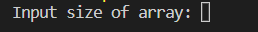
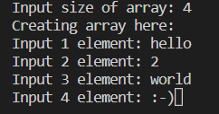
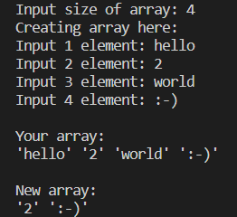

# CreatingStringArray

## Описание программы _CreatingStringArray_

Программа формирует из имеющегося массива строк новый массив из строк, длина которых меньше либо равна 3 символа. Размер и значения элементов (строк) первоначального массива Пользователь вводит с клавиатуры.

## Алгоритм работы программы

Алгоритм работы программы отображен в графическом виде в файле “Block_diagram.md”.

## Как работать с программой

1. Для создания первоначального массива строк программа запрашивает у пользователя размер первоначального массива. Пользователь с клавиатуры вводит число элементов в массиве и нажимает Enter. 

    

2. В зависимости от введенного на предыдущем этапе размера массива программа предлагает пользователю поочередно ввести значение каждого элемента массива (через Enter).  

      

3. Программа отображает в консоли массив, созданный Пользователем, и обозначает его как **“Your array: ”**. Ниже отображается новый массив, созданный на основе первоначального с учетом условия, что длина каждой строки меньше или равна 3 символам. Новый массив обозначен как **“New array: ”**.  

     

## Методы, используемые в работе программы

В работе программы используются три метода:  

* _**CreateArray**_ (создание массива строк - с типом данных string); 

* _**ShowArray**_ (вывод в консоли первоначального массива, созданного пользователем); 

* _**ShowNewArray**_ (вывод в консоли преобразованного массива: длина каждой строки меньше или равна 3 символам). 

## Техническое описание программы

Программа разработана на языке программирования С#, используемый редактор исходного кода: Visual Studio Code. Чтобы открыть программу, необходимо перейти в папку "CreatingStringArray", открыть файл "Program.cs".